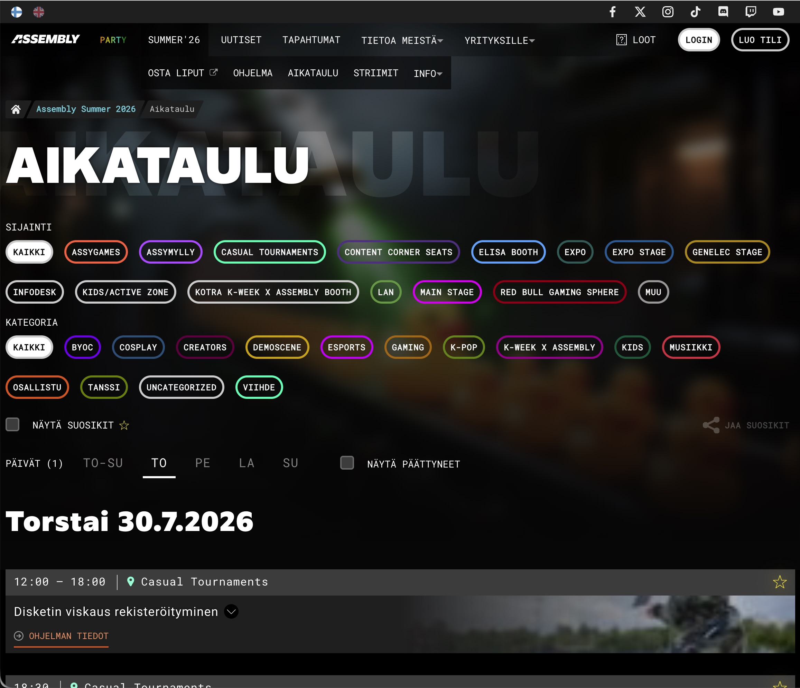
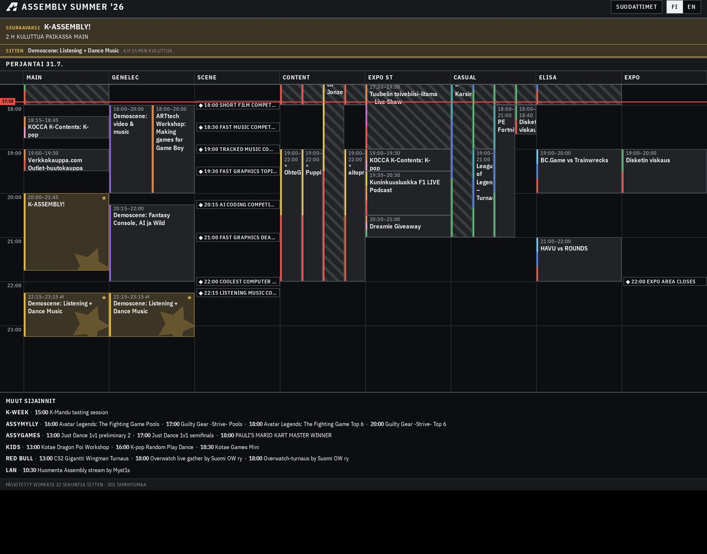

# Assembly 2026 Party Schedule

A 90s TV programming inspired party schedule viewer for [Assembly](https://assembly.org) Summer 2026.

**Live:** [assyt.haila.fi](https://assyt.haila.fi)

The official [Assembly] org website is... fine. But I don't love the party schedule pages. It's actually really hard to know what's going on at any given moment and which ones I was planning to attend.

Here's my fix.

Before:



After:



Party-vibed together with Lovable for the Fix It compo.

## Highlights

- **Always live.** It reads the same GraphQL feed the official site polls, every 60 seconds while the tab is focused, so the schedule stays in sync as things move around during the event.
- **One scrollable stream.** The whole weekend is a single continuous timeline. View the whole party as a stream of parallel happenings across locations.
- **Grid on desktop, list on mobile.** The desktop grid adds as many location columns as your screen fits and collapses the rest into a per-day condensed list. Mobile gets a flat single-column list, because nothing else fits.
- **Knows where "now" is.** Live events get animated stripes, a red rule marks the current time (it never disappears, even between days), and the page lands scrolled to "now".
- **Favourites + a "next up" board.** Star the interesting stuff to curate your own weekend and get a departure-board style countdown to your next favourite. Especially handy on mobile.
- **Filters and colour.** Hide event types you don't care about; a colourblind-safe palette tags the rest.
- **Installable and offline-capable.** Venue wifi is terrible, so it's a home-screen PWA that still opens once you've loaded it once.

## The Deets

The official Assembly site exposes an undocumented WPGraphQL API that this app uses to poll for schedule updates. Additionally the demoscene schedule if fethed from [scene.assembly.org](https://scene.assembly.org) API and displayed as its own event "location".

A few choices I'm happy with:

- **Auto-sorting based on selected filters.** The grid view columns shows locations with most things going on, with the rest collapsed into a condensed section at the bottom of each day.
- **The grid is CSS Grid on 5-minute rows.** Blocks place by row span, overlaps become sub-column lanes, and columns that don't fit are hidden with container queries. This approach needs no JS to look good on any device.
- **Brightness is importance.** It's used in a dark hall, so there's one permanently dark theme where lighter surfaces read as more important.

Every visual and information-architecture decision is logged in [`docs/design/`](docs/design/). Feed it to your favourite AI agent to get going fast.

## Running locally

Uses [Bun](https://bun.sh).

```bash
bun install
bun dev              # dev server
bun run build        # production build
bun run check        # lint + tests
bun run test:smoke   # tests against the live API (schema drift check)
```

## Tech

TanStack Start (SSR) · React 19 · Tailwind CSS v4 · React Query · Zod · deployed on Cloudflare (via Lovable).

## Contributions & Feedback

PR's welcome, if unlikely. Feel free to fork/remix for future events!

## License

MIT
